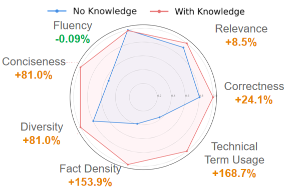
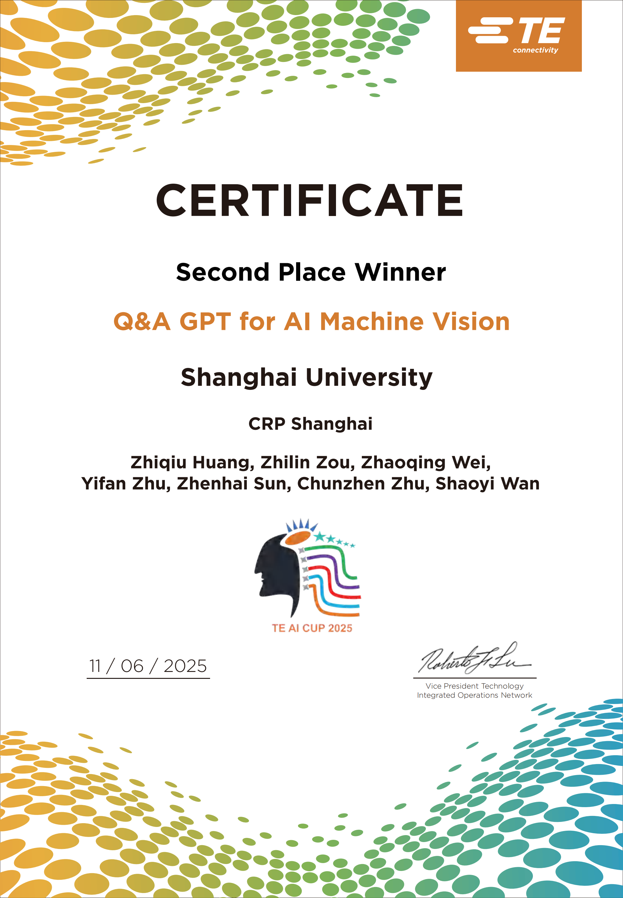

# AIMVQAGPT

**AIMVQAGPT** (AI Machine Vision Q&A GPT ) 是一套企业级本地化 RAG 智能问答系统， 目的是解决TE Connectivity 的AIMV 技术文档查询依赖人工翻阅（平均 30 分钟/次），跨部门技术支持响应超 1 天，且受数据合规与私有化部署的硬性约束等问题。

## 对话请求处理流程(后端)

```text
┌─────────────────────────────────────────────────────────────────────┐
│                         用户在浏览器输入问题                          │
└───────────────────────────────┬─────────────────────────────────────┘
                                │ POST /api/chat/completions
                                ▼
┌─────────────────────────────────────────────────────────────────────┐
│  阶段2: main.py chat_completion()                                   │
│  ┌────────────────────────────────────────────────────────────────┐ │
│  │ 验证用户身份 → 检查模型访问权限 → 构建 metadata                  │ │
│  └────────────────────────────────────────────────────────────────┘ │
└───────────────────────────────┬─────────────────────────────────────┘
                                │
                                ▼
┌─────────────────────────────────────────────────────────────────────┐
│  阶段3: process_chat_payload() — 预处理                             │
│                                                                     │
│  ① 模型知识库 → 自动加入关联的知识库文件                              │
│  ② Pipeline inlet 过滤                                              │
│  ③ Filter Functions 过滤                                            │
│  ④ 特性处理 (web_search / code_interpreter)                         │
│  ⑤ 工具调用 (Function Calling)                                      │
│  ⑥ ★ RAG 文件检索 ★                                                │
│     │  用户问题 → 嵌入向量 → 向量库检索 → 重排序 → sources           │
│  ⑦ 把 sources 拼成 XML → 注入到 system message                     │
│                                                                     │
│  输出: messages 中已经包含了检索到的参考文档                          │
└───────────────────────────────┬─────────────────────────────────────┘
                                │
                                ▼
┌─────────────────────────────────────────────────────────────────────┐
│  阶段4: chat_completion_handler() — 调用 LLM                       │
│                                                                     │
│  根据 model.owned_by 分发:                                          │
│  ├── "ollama"  → 转格式 → POST Ollama /api/chat                    │
│  ├── "openai"  → POST OpenAI /chat/completions                     │
│  └── pipe模型  → 调用自定义 Python 函数                              │
│                                                                     │
│  LLM 基于 messages（含 RAG 上下文）生成回答                          │
└───────────────────────────────┬─────────────────────────────────────┘
                                │ 流式响应
                                ▼
┌─────────────────────────────────────────────────────────────────────┐
│  阶段5: process_chat_response() — 后处理                            │
│                                                                     │
│  逐行解析流式输出 → 流式 Filter → WebSocket 实时推送到前端           │
│  完成后: 生成标题 / 标签 / 保存数据库 / Webhook                      │
└───────────────────────────────┬─────────────────────────────────────┘
                                │ WebSocket (Socket.IO)
                                ▼
┌─────────────────────────────────────────────────────────────────────┐
│                    前端实时显示 LLM 的回答 + 引用来源                  │
└─────────────────────────────────────────────────────────────────────┘
```

另有一份可交互排版的**可视化架构页**：[project_architecture.html](./project_architecture.html)。在 GitHub 仓库里点开该文件会看到 HTML 源码；下载到本地后双击用浏览器打开，或使用 Raw 链接在浏览器中打开即可正常渲染。
这也有[项目目录](project_structure.md)

## 快速开始

确保已安装 [Docker](https://docs.docker.com/get-docker/)，然后执行：

```bash
git clone https://github.com/maple0leaves/AIMVQAGPT.git
cd AIMVQAGPT
docker compose up --build
```

启动完成后访问 [http://localhost:3000](http://localhost:3000)。

> 首次构建约需 5–15 分钟（需下载依赖并编译前端），后续启动可省略 `--build`。

## 主要功能

**功能演示**移步个人B站视频：[AIMVQAGPT功能演示]()

- **Ollama / OpenAI API 集成**：支持 Ollama 本地模型及 OpenAI 兼容 API
- **RAG 检索增强生成**：支持上传文档并在对话中引用
- **Function Calling**：可为模型绑定自定义工具（如 Web 搜索等），由 LLM 自动选择并调用
- **多模型并行对话**：同时使用多个模型获取最优回答
- **权限管理 (RBAC)**：细粒度的角色和权限控制
- **多语言支持**：内置国际化 (i18n) 支持
- **响应式设计**：适配桌面、笔记本和移动设备
- **PWA 支持**：支持安装为移动端 App

## RAG 效果评估

对比「无知识库」与「接入知识库」时，在流利度、相关性、正确性、术语使用、事实密度、多样性、简洁性等维度上的表现（雷达图）。



## 开发模式

如需进行本地开发调试，请参考 [启动命令速查](docs/STARTUP_COMMANDS.md)。

## 参考

[openwebui](https://github.com/open-webui/open-webui)

## 许可证

本项目基于 [BSD-3-Clause License](LICENSE) 开源。

## 获奖

### 本项目获得第六届TE Connectivity AI Cup 全球二等奖


